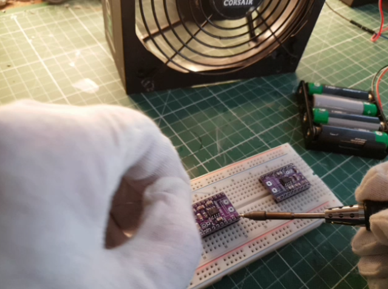

[An early experiment to validate PSU fan for solder fume extraction capability](./images/fumeclip.png)

## Hackaday Project Solder Fume Extractor - Hardware

Hackaday project repository for the [Solder Fume Extractor Deluxe](https://hackaday.io/project/187925-solder-fume-extraction-station-deluxe-from-scrap) - `from scrap`.

In this repository, you'll find KiCad design files and Gerbers files ready to send to [JLCPCB](https://jlcpcb.com), [PCBWay](https://www.pcbway.com) [Oshpark](https://oshpark.com), or a similar PCB prototype supplier.

As we release ideas and designs, we will add them here.

## Use cases

I initially identified four use cases.

- **Truly portable**
        - Run the fume-extractor continuously for 8-10 hours with the built-in battery pack before re-charging.

- **Wall outlet powered**
        - Run the unit from either a USB power bank or a USB wall adapter.

- **Detach the electronic unit, and use it to charge lithium cells**
        - I create multiple uses of the core unit and do not waste unnecessary resources for only a single-use case.

- **Detach the electronic unit, and use it as a power bank with the built-in microcontroller**
        - Use the detached unit with a microcontroller in other Arduino projects to keep this from becoming scrap.

## Mynotes

`Mynotes` folder is the home for preliminary material and any material that does not belong to KiCad. The content here will increase steadily as the project progress. Thus, this is the first location to look for the latest.

## Project log

Follow the daily progress project log on [Hackaday](https://hackaday.io/project/187925-solder-fume-extraction-station-deluxe-from-scrap). 

## Planned Improvements/Changes

For planned changes, improvements, and possible encountered issues, please visit the [GitHub issues tracker](https://github.com/berrak/solder-fume-extractor-hw/issues), or join the discussion on `Hackaday`.

## About structure

Use the `kicad-init-sh` shell script to set up a new [KiCad project structure](https://github.com/berrak/kicad-init-file-structure).

## License Information

This product is open source!

Please review the [LICENSE](./LICENSE.md) file for information.

Distributed as-is; no warranty is given.
